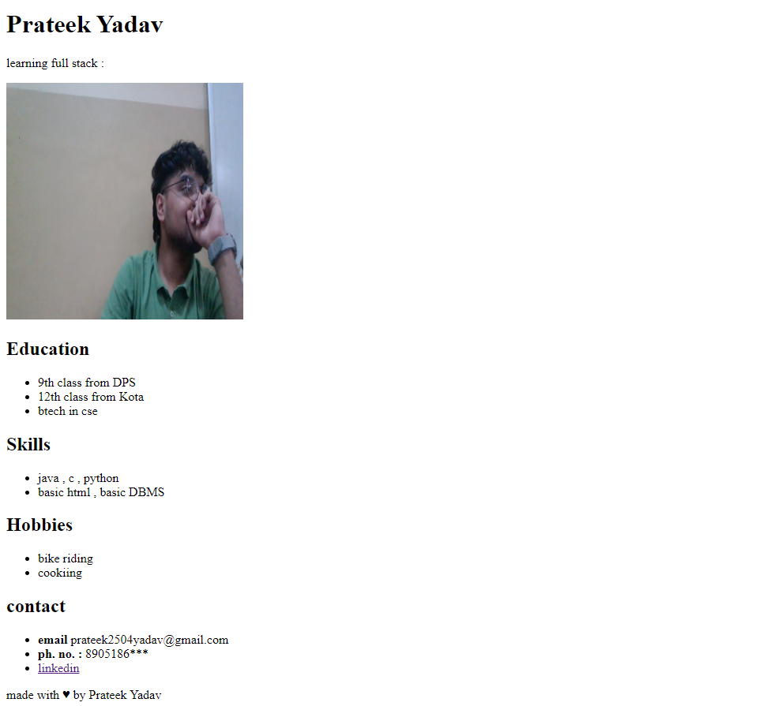

# HTML-style-Portfolio

During my initial learning journey in web development, I created a portfolio page using only HTML. This project helped me understand the fundamentals of website structure and gave me a strong foundation in the first layer of web development.

## Screenshot

